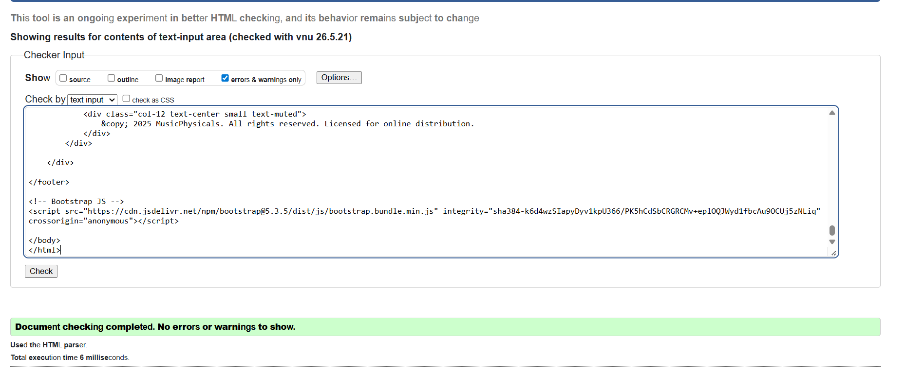
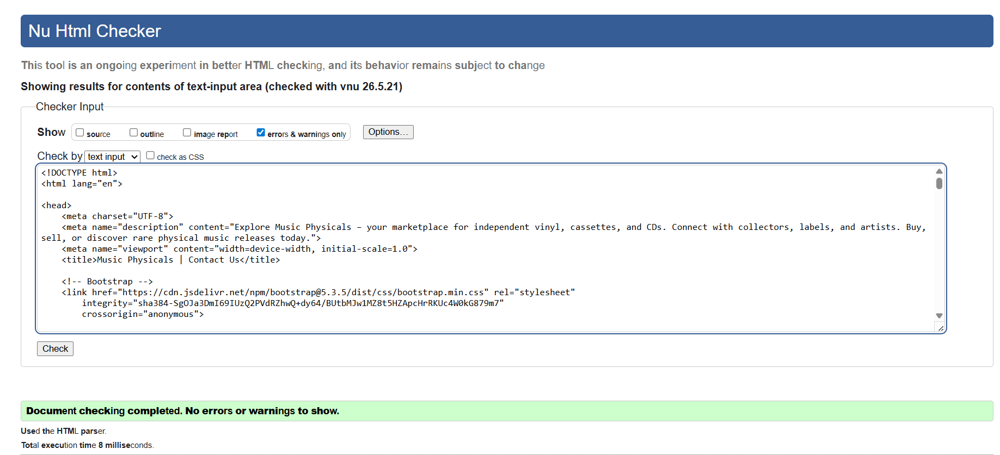
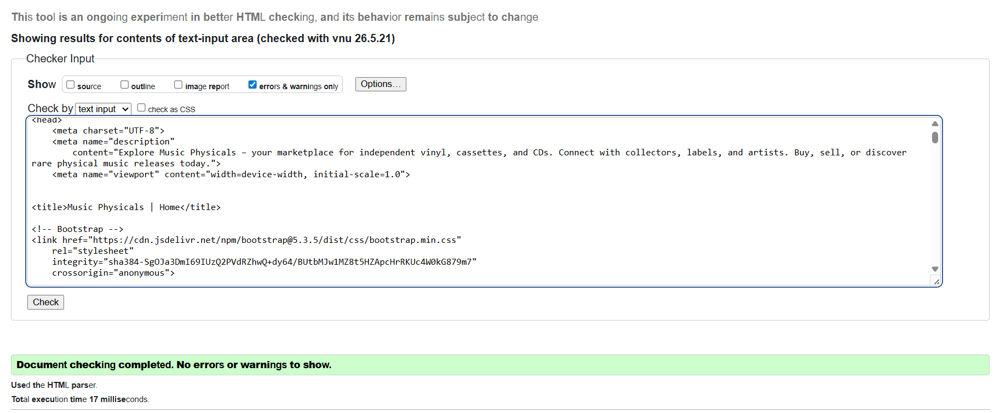
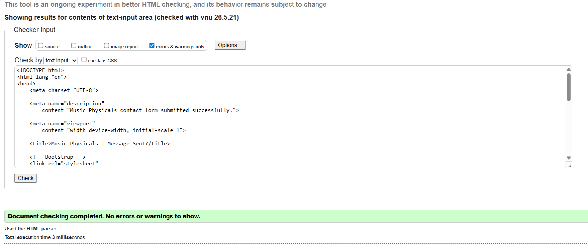

## ✅ Deployed GitHub Pages Website Testing Checklist
**Yes** =**Y**
**No** = **N**

| Test # | Test Area              | What to Check on the Live Page                                                    | Expected Outcome                                 | Test Result |
|--------|------------------------|--------------------------------------------------------------------------|--------------------------------------------------|-------------|
| [1](#1)      | **Homepage Loads** | Site loads fully with no errors (check browser console, network tab, images)    | No console errors, broken links, or 404s         | Y           |
| [2](#2)     | **Navigation** | Test all navbar links (Home, Contact Us, Product Page, etc.)            | Each link redirects to correct page              | Y            |
| [3](#3)      | **Mobile View**         | Navbar collapses into hamburger; menu expands and links work            | Layout is responsive and interactive        | Y
[4](#4)   | **Content Layout**      | Review all content blocks: hero, cards, sections                         | Matches design specs, spacing consistent         |  Y           |
 [5](#5)     | **Meta Tags**           | Inspect HTML head: `<title>`, `<meta name="description">`                 | Title/description show in browser and previews   |     Y        |
 [6](#6)    | **Forms / Buttons**     | Test interactivity: form validation, submit, button clicks                 | Actions work; error/success states appear        |        Y     |

## 1

## Homepage Loads

### clicking on live link page

### loading index page without any error message

### checking through inspect mode 

### no error message

## 2

## Navigation

### Contact us from the index page.

### Contact page loaded.

### Product clicked from the the index page.

### Correct loading product page.

### Clicking to the home/index tab from product page.

### Home/index page loading correctly

### Clicking onto home page tab from the contact us page

### loading home screen from the contact us tab / page.

### Loading contact us tab from the product page.

### Clicking on product page from contact page

### loading the contact page from contact page.

## 3

### Burger menu navigation bar unclicked

### Burger menu working as well as the page is able to scroll

## >

## 4 

### Index layout and colour scheme and layout works together

### Contact us layout colour scheme and layout works

### Product page 

## 5
Tab meta of each page match their Navbar title:

Product page tab:

Contact us tab :

Home tab :

## 6

form button works 

result of clicking button:

result of clicking return button 

## W3C HTML Validation

### index.html

Result: No errors found.

### contact-us.html

Result: No errors found.

### product-page.html

Result: No errors found.

### success.html

Result: No errors found.

## CSS Validation

### styles.css

Result: No errors found.